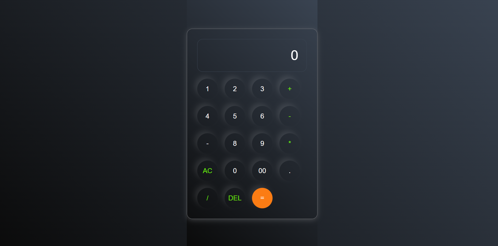
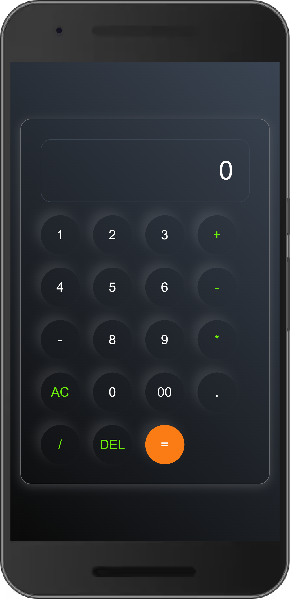

# Calculator
Basic Calculator app

# Preview : https://calculator-react-tau-ten.vercel.app/

## Screenshots
## full view

#  Mobile view

## Deployment

Deployed Link: https://calculator-react-tau-ten.vercel.app/

# Clone the repository

https://github.com/mohdadil12345/calculator_React/tree/main/calculator

### features

- Simple calculator where we can do any operator like add substract multiply etc.

## Tools and Technologies
- Javascript
- React
- Html
- css

## Installation and Setup

1.Install React npm : npm i
2. Run the Application : ng run start
